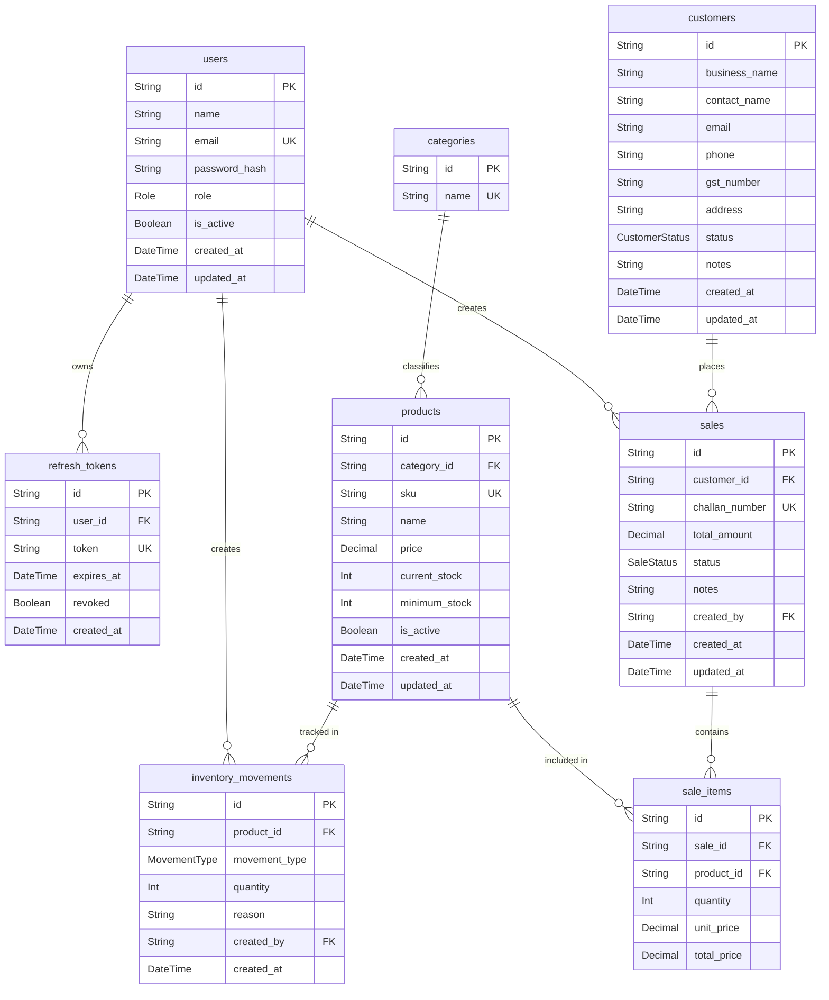

# Backend Architecture & Responsibilities

This backend is built using **Node.js, Express, TypeScript, and Prisma ORM**. It follows a Feature-Based Modular Architecture to keep the codebase clean, scalable, and maintainable.

## Folder Structure

```
backend/
├── prisma/               # Prisma schema and database migrations
├── src/
│   ├── config/           # Environment variables, database and JWT setup
│   ├── controllers/      # (Optional) Global controllers, though mostly in modules/
│   ├── middlewares/      # Authentication, RBAC, Error Handling
│   ├── modules/          # Feature-based module grouping (see below)
│   ├── utils/            # Shared utilities (pagination, helpers, constants)
│   ├── validators/       # Zod validation schemas
│   ├── app.ts            # Express app configuration
│   └── server.ts         # Server entry point
```

## Feature-Based Modules

Each feature (module) handles its own routes, controllers, and services. The active modules are:

- `auth`: Login, Logout, Refresh Token, Protected Routes.
- `customers`: Customer CRUD operations.
- `products`: Product CRUD and Categories management.
- `inventory`: Stock IN/OUT and Movement History.
- `sales`: Sales Challan creation and auto stock reduction.
- `analytics`: Dashboard KPIs and charts.

### Internal Module Architecture

Within each module, the flow of data follows this clean architecture pattern:

```text
Routes -> Controllers -> Services -> Repositories -> Prisma ORM -> PostgreSQL
```

- **Routes:** Maps HTTP endpoints to controller methods.
- **Controllers:** Parses HTTP requests, validates inputs, and sends HTTP responses. Controllers remain thin.
- **Services:** Contains all business logic (e.g., checking stock before a sale).
- **Repositories:** Handles direct database interactions (Prisma queries).

## Database Schema (ER Diagram)

Below is the Entity-Relationship (ER) diagram for the core entities managed by this backend.


